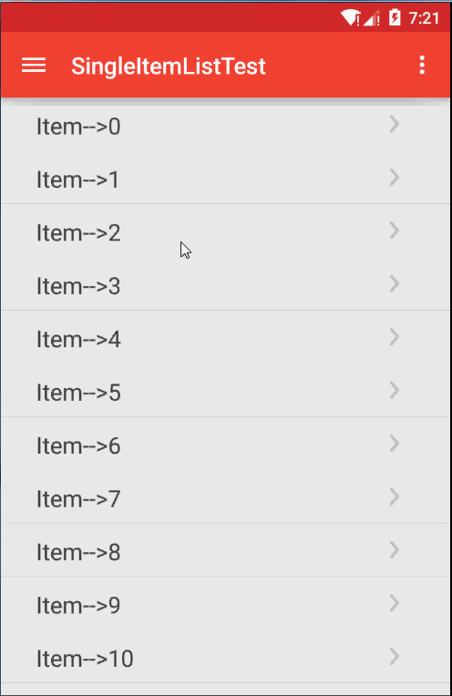

LightUtils for Android
=================
This is a light android utils lib.

[  ](https://bintray.com/ls1110924/maven/LightUtilsLib/_latestVersion)

## DEMO


## Why
因为在我码代码的过程中，比如在写Activity或者Fragment的时候，发现常常再写一些重复性的东西，后来我就干脆自己封装一个库，把重复性的东西抽象出来，
这样以后写的时候就可以少做一些重复的事。另外对一些常见的模块进行了封装，以便更加方便的使用，如仿微信式的延迟加载的Fragment以及复用convertView的Adapter等。

## Features
- 对常见的Activity类进行了封装，如带ActionBar的Activity类，带ToolBar的Activity类，带DrawerLayout的Activity类以及无Title的Activity等，
- 对常见的Fragment类进行了封装，以便优化Fragment的加载和交互等，如有静态视图的Fragment，动态视图的Fragment，同步延迟加载的Fragment以及异步延迟加载的Fragment等。
- 对常用的Adapter类进行了模板化封装，如提供单一内容布局的Adapter以及提供多套内容布局的Adapter，两者都把常见的复用ConvertView以及ViewHolder优化集成，可方便使用。
- 对网络部分进行了简单的封装。
- 对Service进行了简单的封装，并对异步任务使用线程池执行，尽量节省创建销魂线程等不必要的开销。
- 封装了一些常用工具类，如适用于Activity的Handler和适用于Fragment的Handler类等。

## How to use

```groovy
repositories {
    jcenter()
}

dependencies {
	compile 'com.github.ls1110924.library:light-utils:1.3.0'
}
```